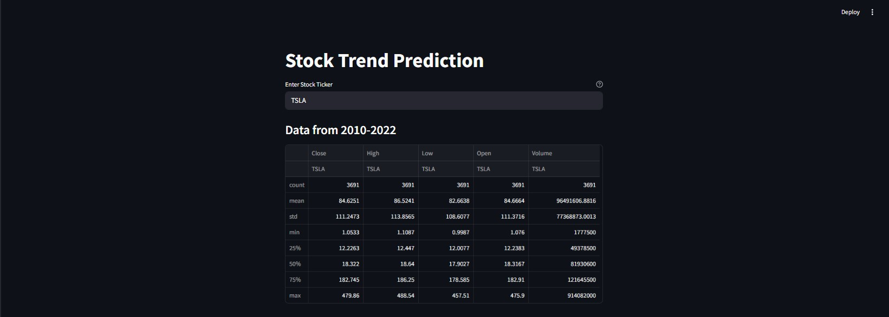
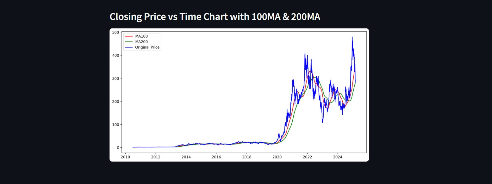

# Stock Trend Prediction

## Overview
Stock Trend Prediction is a web application that allows users to analyze and visualize historical stock price trends. The app fetches stock market data using `yfinance` and provides key insights through various visualizations, including moving averages.

## Features
- Fetch historical stock data from Yahoo Finance.
- Visualize stock closing prices over time.
- Display 100-day and 200-day moving averages for trend analysis.
- Interactive user input for selecting stock tickers.
- Sidebar details for data fetch status and statistics.

## Technologies Used
- Python
- Streamlit
- yfinance
- Matplotlib

## Installation
1. Clone the repository:
   ```sh
   git clone https://github.com/Minhaj401/StockTrendPrediction.git
   cd StockTrendPrediction
   ```

2. Install required dependencies:
   ```sh
   pip install streamlit yfinance matplotlib
   ```

3. Run the application:
   ```sh
   streamlit run app.py
   ```

## Usage
1. Enter a stock ticker symbol (e.g., AAPL, GOOGL, MSFT) in the input field.
2. The app fetches historical stock data from Yahoo Finance.
3. View statistical summaries and stock price trends.
4. Analyze charts including:
   - Closing Price vs Time
   - Closing Price with 100-day Moving Average
   - Closing Price with 100-day & 200-day Moving Averages

## Example Output
- Stock price trend visualizations with moving averages.
- Data statistics displayed in an interactive format.

## Screenshots
#### 1. Stock Data Summary  
   

#### 2. Moving Averages Chart  
  


## Contact
For any inquiries, feel free to reach out to [Minhaj Noushad](https://www.linkedin.com/in/minhaj-noushad-9ab526308/).
